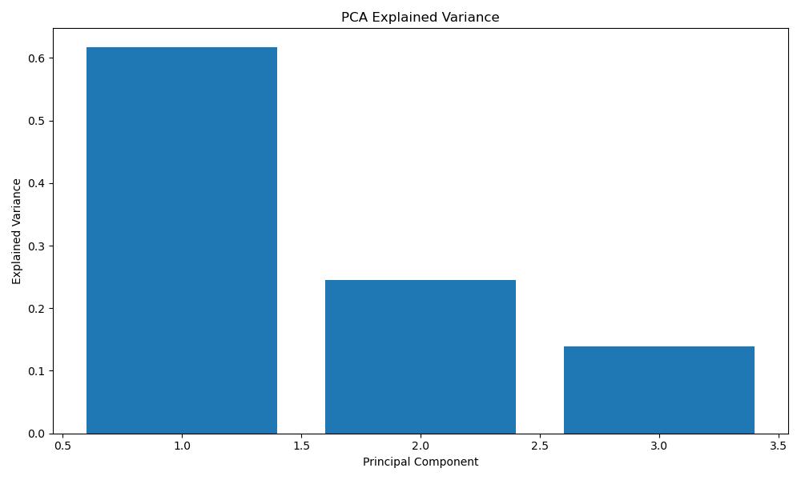
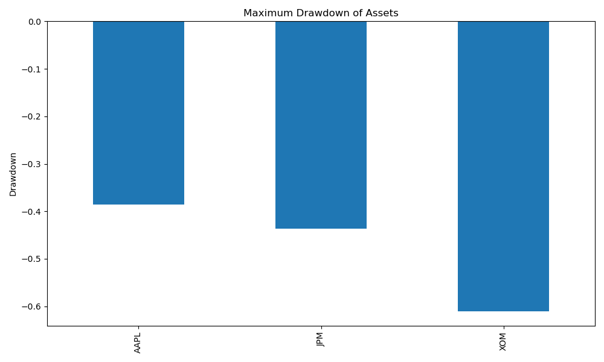

# Equity Factor Analysis
## Introduction
This project was chosen to deepen my understanding of equity returns, while strengthening my skills in python, data analysis, and financial modeling. By examining how different models explain stock returns, I aim to develop the foundational skills to pursue a career in quantitative finance or asset management. This project allows me to bridge the gap between my academic studies and practical skills that I can apply in a professional environment.

### Research Question
Which factors best explain the variation in daily stock returns?

### Assets Analyzed:
- Apple (AAPL)
- JPMorgan Chase & Co (JPM)
- Exxon Mobil Corporation (XOM)

## Data
### Data Source: 
yfinance

### Timeframe 
January 1, 2015 - January 1, 2025 (10 Year Period)

### Processing steps:
Asset returns were calculated from adjusted close price, then merged into one csv aligned by date.

## Methodology
- **CAPM (Capital Asset Pricing Model):** Models stock returns as a function of market returns to estimate alpha and beta.
- **Fama-French 3-Factor Model:** Includes market, size, and value factors to explain returns beyond CAPM.
- **PCA:** Uses principal component analysis to extract the main drivers of return variation from the data.
- **Risk Metrics:** Volatility, variance, and maximum drawdown were calculated for each asset.

## Exploratory Analysis
- Summary statistics (mean, standard deviation, min, max) for each asset.
- Plots:
  - Cumulative returns over time.
  - Correlation heatmap of returns.
- Observations:
  - Any notable trends or outliers.

## Results
### **CAPM:**

| Asset | Alpha    | Beta     |
|-------|----------|----------|
| AAPL  | 0.000442 | 1.192493 |
| JPM   | 0.000187 | 1.107361 |
| XOM   | -0.000090| 0.854571 |

- Beta for AAPL and JPM are above 1, indicating more volatility to market movements, where as XOM is less sensitive to market movements.
- Alphas for all of our assets are very close to zero, this suggests that CAPM does not seem to detect abnormal returns.

### **Fama-French 3-Factor Model:** 

| Asset | Alpha    | MKT      | SMB       | HML       |
|-------|----------|----------|-----------|-----------|
| AAPL  | 0.000326 | 1.072791 | -0.193184 | -0.613531 |
| JPM   | 0.000331 | 1.285035 | 0.183652  | 0.862945  |
| XOM   | 0.000056 | 1.061635 | 0.131697  | 0.967573  |

- Market (MKT) Beta: Similar to CAPM, but is adjusted due to SMB and HML
- Size (SMB): 
    - AAPL is negative, which means that it behaves like a large-cap stock.
    - JPM and XOM both having positive SMB, suggests that they perform like small-cap stocks.
- Value (HML):
    - AAPL's negative HML tells us that it behaves like a growth stock, which we can see later on in our cumulative returns.
    - JPM and XOM both have value stock characteristics based on the observed HML.
- Alpha: Still very close to zero

### **PCA:**

*Figure 1: Cumulative variance explained by the first three principal components.*

### **Risk Metrics:** Volatility and maximum drawdown results.

| Asset | Volatility| 5% VaR    |
|-------|-----------|-----------|
| AAPL  | 0.284670  | -0.026996 |
| JPM   | 0.273755  | -0.025339 |
| XOM   | 0.277881  | -0.025922 |

*Figure 2: Cumulative returns of AAPL, JPM, and XOM from 2015 to 2025.*

*Figure 3: Maximum drawdown of AAPL, JPM, and XOM over 2015-2025*

## Discussion
- CAPM vs. Fama-French: Which model explains returns better?
    - The CAPM shows that all three assets are influenced by market movements, since they are very close to one. However, the Fama-French model showed us that the size and value factors that was not accounted for in the CAPM, since they also influence how the assets moved. The Fama-French gave us proof that XOM and JPM has value stock characteristics due to the positive HML (0.967573 and 0.862945), where as for AAPL is consistent with growth stock behavior.

- PCA insights
    - The PCA results show that a small number of components explain most of the variation in asset returns. Our first principal component (Approx. 60%) explains most of variance, which represents a broad market factor affecting all assets. The second component (Approx. 25%) explains the movement from different sectors. Lastly third components (Approx. 15%) indicates that some movements are still unexplained.

- Risk analysis interpretation
    - Our risk analysis shows that AAPL has the highest volatility, with XOM having the largest maximum drawdown, which indicates greater downside risk during periods of market stress. JPM is relatively balanced, shown by moderate drawdown and volatility, both in between AAPL and XOM.

## Conclusion
- Main findings from the factor analysis:
    - This project analyzed the drivers of equity returns for AAPL, JPM, and XOM using CAPM, the Fama-French 3-Factor model, PCA, and several risk metrics. The results show that market risk is the dominant driver of returns, many other factors such as size and value also contribute to explaining return variation.

- Implications for portfolio management or investment decisions:
    - PCA results explains that most return variation can be captured by a small number of latent factors, this reinforces the idea that equity returns are driven by common factors. Risk metrics highlight differences in volatility and downside risk across assets, which are critical considerations for portfolio construction and risk management.

- Suggestions for future research:
    - For future research projects, I may extend this analysis by adding additional factors, such as momentum or profitability, or expanding to different asset sectors. Overall, this project strengthens what I learned in the classroom by applying them to real world applications.

## References
- Tsay, R. S. (2010). *Analysis of Financial Time Series* (3rd Edition). Wiley.
- Yves Hilpisch (2019). *Python for Finance: Mastering Data-Driven Finance* (2nd Edition).  O'Reilly Media.
- Data sources: yfinance (Asset and factor data).